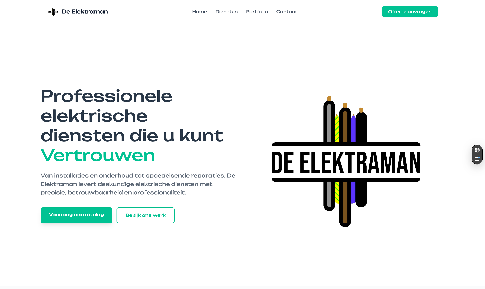

# De Elektraman

Professional electrical services website built with Nuxt 4, Vue 3, and Tailwind CSS 4. A modern, responsive platform for
electrical service companies featuring real-time business hours detection, portfolio showcase, service listings, and
contact functionality.



## Features

- Modern UI/UX with smooth page transitions
- Fully responsive design optimized for all screen sizes
- Performance optimized with Nuxt 4 SSR
- Smart business hours detection with real-time status indicators
- Portfolio gallery with image optimization
- Contact integration with email and phone links
- SEO friendly with server-side rendering
- Accessible design following WCAG guidelines
- Content management powered by Nuxt Content
- Environment-based configuration

## Tech Stack

- [Nuxt 4](https://nuxt.com/) - Vue framework for production
- [Vue 3](https://vuejs.org/) - Progressive JavaScript framework
- [Tailwind CSS 4](https://tailwindcss.com/) - Utility-first CSS framework
- [TypeScript](https://www.typescriptlang.org/) - Type-safe JavaScript
- [Heroicons](https://heroicons.com/) - Beautiful hand-crafted SVG icons
- [Motion](https://motion.dev/) - Animation library for Vue
- [Nuxt Content](https://content.nuxt.com/) - File-based CMS
- [Nuxt Image](https://image.nuxt.com/) - Optimized images
- [ESLint](https://eslint.org/) - Code quality and consistency

## Prerequisites

- Node.js >= 20.0.0
- Package manager (npm, pnpm, yarn, or bun)

## Installation

Clone the repository

```bash
git clone https://github.com/Raadfxrd/de-elektraman.git
cd de-elektraman
```

Install dependencies

<details open>
<summary><b>npm</b></summary>

```bash
npm install
```

</details>

<details>
<summary><b>pnpm</b></summary>

```bash
pnpm install
```

</details>

<details>
<summary><b>yarn</b></summary>

```bash
yarn install
```

</details>

<details>
<summary><b>bun</b></summary>

```bash
bun install
```

</details>

Set up environment variables

```bash
cp .env.example .env
```

Configure your environment variables. See [ENV_VARIABLES.md](./ENV_VARIABLES.md) for detailed configuration
instructions.

## Development

Start the development server on `http://localhost:3000`

<details open>
<summary><b>npm</b></summary>

```bash
npm run dev
```

</details>

<details>
<summary><b>pnpm</b></summary>

```bash
pnpm dev
```

</details>

<details>
<summary><b>yarn</b></summary>

```bash
yarn dev
```

</details>

<details>
<summary><b>bun</b></summary>

```bash
bun run dev
```

</details>

## Building for Production

Build the application for production

<details open>
<summary><b>npm</b></summary>

```bash
npm run build
```

</details>

<details>
<summary><b>pnpm</b></summary>

```bash
pnpm build
```

</details>

<details>
<summary><b>yarn</b></summary>

```bash
yarn build
```

</details>

<details>
<summary><b>bun</b></summary>

```bash
bun run build
```

</details>

Preview production build

<details open>
<summary><b>npm</b></summary>

```bash
npm run preview
```

</details>

<details>
<summary><b>pnpm</b></summary>

```bash
pnpm preview
```

</details>

<details>
<summary><b>yarn</b></summary>

```bash
yarn preview
```

</details>

<details>
<summary><b>bun</b></summary>

```bash
bun run preview
```

</details>

## Project Structure

```
de-elektraman/
├── app/
│   ├── assets/
│   │   ├── css/          # Global styles
│   │   └── img/          # Static images
│   ├── components/       # Vue components
│   │   ├── AppFooter.vue
│   │   ├── AppNavbar.vue
│   │   ├── BackToTop.vue
│   │   ├── CallToAction.vue
│   │   ├── ContactCard.vue
│   │   ├── FeatureItem.vue
│   │   ├── PageHero.vue
│   │   ├── ProcessSection.vue
│   │   ├── SectionHeader.vue
│   │   ├── ServiceCard.vue
│   │   ├── SmallServiceCard.vue
│   │   └── SpecializedServiceCard.vue
│   ├── composables/      # Reusable composition functions
│   │   ├── useBusinessHours.ts
│   │   └── useCompanyInfo.ts
│   ├── layouts/          # Page layouts
│   │   └── default.vue
│   └── pages/            # Application pages
│       ├── index.vue     # Homepage
│       ├── services.vue  # Services page
│       ├── portfolio.vue # Portfolio gallery
│       └── contact.vue   # Contact page
├── public/               # Static assets
├── nuxt.config.ts        # Nuxt configuration
├── tailwind.config.js    # Tailwind configuration
└── tsconfig.json         # TypeScript configuration
```

## Customization

### Company Information

All company information is configured through environment variables. Update your `.env` file to customize:

- Company name and slogan
- Contact information (phone, email, address)
- Business hours
- Social media links
- Company statistics

See [ENV_VARIABLES.md](./ENV_VARIABLES.md) for the complete list of available variables.

### Styling

The project uses Tailwind CSS 4. Customize the design by:

1. Editing `app/assets/css/main.css` for global styles
2. Using Tailwind utility classes in components
3. Modifying the Tailwind configuration if needed

### Components

All components are located in `app/components/` and are auto-imported by Nuxt. Simply use them in your pages:

```vue

<template>
  <ServiceCard
      title="Your Service"
      description="Service description"
  />
</template>
```

### Composables

Two main composables provide reusable functionality:

- **`useCompanyInfo()`** - Access all company information from environment variables
- **`useBusinessHours()`** - Check if the business is currently open

```vue

<script setup>
  const companyInfo = useCompanyInfo()
  const {isOpen} = useBusinessHours()
</script>
```

## Adding Content

### Portfolio Images

Add images to the `public/` directory and reference them in your portfolio page:

```vue

```

### Pages

Create new pages by adding `.vue` files to `app/pages/`. Nuxt automatically creates routes based on the file structure.

## Deployment

### Vercel (Recommended)

1. Push your code to GitHub
2. Import your repository in Vercel
3. Configure environment variables in project settings
4. Deploy!

### Netlify

1. Push your code to GitHub
2. Create a new site in Netlify
3. Configure build settings:
    - Build command: `npm run build`
    - Publish directory: `.output/public`
4. Add environment variables
5. Deploy!

### Other Platforms

This is a standard Nuxt 4 application and can be deployed to any platform that supports Node.js. See
the [Nuxt deployment documentation](https://nuxt.com/docs/getting-started/deployment) for more options.

## Code Quality

The project uses ESLint for code quality:

```bash
npm run lint
```

## License

This project is private and proprietary.

## Contributing

This is a private project. For any questions or issues, please contact the project maintainer.

## Support

For support, email your-email@example.com or contact through the website.

---

Built with ❤️ using [Nuxt](https://nuxt.com/)
